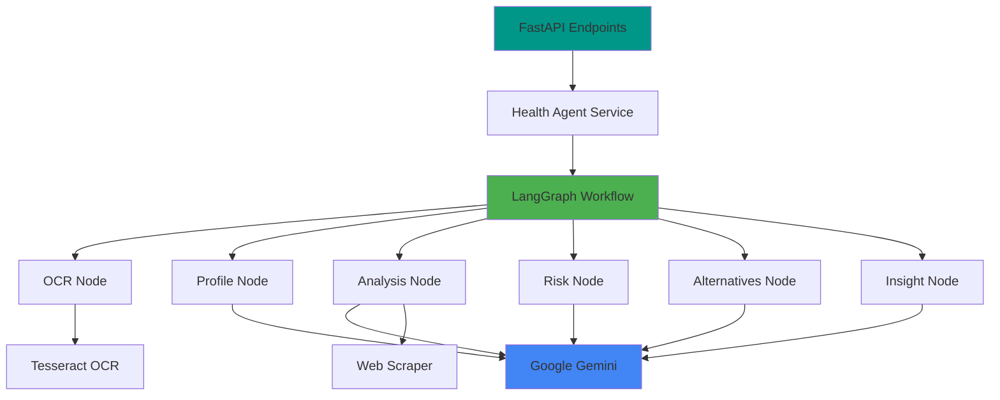
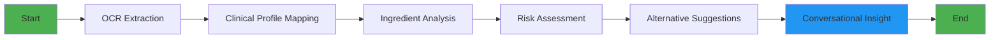

# 🏥 Health Agent FastAPI Server

> AI-powered food label analysis and health risk assessment API using LangChain, LangGraph, and Google Gemini AI


## 📋 Table of Contents

- [Overview](#overview)
- [Features](#features)
- [Architecture](#architecture)
- [Project Structure](#project-structure)
- [Prerequisites](#prerequisites)
- [Setup](#setup)
- [Running the Server](#running-the-server)
- [API Documentation](#api-documentation)
- [API Endpoints](#api-endpoints)
- [LangGraph Workflow](#langgraph-workflow)
- [Environment Variables](#environment-variables)
- [Integration](#integration)
- [Deployment](#deployment)
- [Troubleshooting](#troubleshooting)
- [Development](#development)

## 🎯 Overview

The **Health Agent FastAPI Server** is an intelligent AI backend that analyzes food product ingredients and assesses health risks based on user health profiles. It uses a sophisticated LangGraph workflow to orchestrate multiple AI agents for OCR extraction, clinical analysis, and personalized recommendations.

### Key Capabilities

- 🔍 **OCR-based Label Extraction** - Extract brand names and ingredient lists from food label images
- 🧬 **Clinical Health Profiling** - Convert user health conditions into bio-chemical triggers
- 📊 **Ingredient Analysis** - Fetch clinical evidence and regulatory information for each ingredient
- ⚠️ **Risk Assessment** - Identify health risks based on user profile and ingredient data
- 💡 **Smart Recommendations** - Suggest healthier product alternatives
- 🤖 **Conversational AI** - Friendly, expert health insights with visual indicators (🟢/🟡/🔴)

## ✨ Features

### Core Features

- **Multi-modal Input** - Support for image upload and URL-based analysis
- **Google Gemini 2.0** - Latest AI model for advanced reasoning
- **LangGraph Orchestration** - Sophisticated multi-agent workflow
- **OCR Processing** - Tesseract integration for text extraction
- **Web Scraping** - Real-time clinical research lookup
- **NOVA Classification** - Food processing level assessment
- **Regulatory Database** - International food safety regulations

### Technical Features

- **Async FastAPI** - High-performance async endpoints
- **Pydantic Validation** - Strong typing and data validation
- **CORS Support** - Configured for frontend integration
- **Error Handling** - Comprehensive exception management
- **Logging** - Detailed application logging
- **File Upload** - Multipart form data support

## 🏗 Architecture

### System Design



### Component Breakdown

1. **API Layer** (`app/api/routes/`)
   - RESTful endpoints
   - Request validation
   - Response formatting

2. **Service Layer** (`app/services/health_agent/`)
   - Business logic
   - LangGraph workflow orchestration
   - AI agent coordination

3. **Middleware** (`app/middleware/`)
   - CORS handling
   - Global exception handling
   - Request logging

4. **Utilities** (`app/utils/`)
   - File handling
   - Logging configuration
   - Helper functions

## 📁 Project Structure

```
FASTAPISERVER/
├── app/
│   ├── api/                    # API routes
│   │   ├── __init__.py
│   │   └── routes/
│   │       └── health_analysis.py
│   ├── config/                 # Configuration
│   │   ├── __init__.py
│   │   └── settings.py
│   ├── middleware/             # Middleware
│   │   ├── __init__.py
│   │   ├── cors.py
│   │   └── error_handler.py
│   ├── models/                 # Pydantic models
│   │   ├── __init__.py
│   │   ├── requests.py
│   │   └── responses.py
│   ├── services/               # Business logic
│   │   ├── __init__.py
│   │   └── health_agent/
│   │       ├── __init__.py
│   │       ├── nodes.py        # LangGraph node functions
│   │       ├── state.py        # State management
│   │       ├── tools.py        # Agent tools
│   │       └── workflow.py     # LangGraph workflow
│   ├── utils/                  # Utilities
│   │   ├── __init__.py
│   │   ├── file_handler.py
│   │   └── logger.py
│   └── main.py                 # FastAPI app
├── uploads/                    # Temporary file storage
├── logs/                       # Application logs
├── .env                        # Environment variables
├── .env.example                # Environment template
├── .gitignore
├── requirements.txt            # Python dependencies
├── run.py                      # Server startup script
└── README.md                   # This file
```

## 📦 Prerequisites

### Required Software

1. **Python 3.10+**
   ```bash
   python --version
   # Should output: Python 3.10.x or higher
   ```

2. **Tesseract OCR**
   
   **macOS**:
   ```bash
   brew install tesseract
   ```
   
   **Linux (Ubuntu/Debian)**:
   ```bash
   sudo apt-get update
   sudo apt-get install tesseract-ocr
   ```
   
   **Windows**:
   Download from: https://github.com/UB-Mannheim/tesseract/wiki

3. **Google AI API Key**
   - Get your free API key from [Google AI Studio](https://makersuite.google.com/app/apikey)
   - Required for Gemini AI access

## 🚀 Setup

### 1. Navigate to Project Directory
```bash
cd FASTAPISERVER
```

### 2. Create Virtual Environment
```bash
# Create virtual environment
python -m venv venv

# Activate (macOS/Linux)
source venv/bin/activate

# Activate (Windows)
venv\Scripts\activate
```

### 3. Install Dependencies
```bash
pip install --upgrade pip
pip install -r requirements.txt
```

### 4. Configure Environment Variables
```bash
cp .env.example .env
```

Edit `.env` and add your configuration:
```env
GOOGLE_API_KEY=your_actual_google_api_key_here
GEMINI_MODEL=gemini-2.0-flash-exp
HOST=0.0.0.0
PORT=8000
DEBUG=True
```

### 5. Create Required Directories
```bash
mkdir -p uploads logs
```

## 🏃 Running the Server

### Development Mode (with auto-reload)
```bash
python run.py
```

Or using uvicorn directly:
```bash
uvicorn app.main:app --reload --host 0.0.0.0 --port 8000
```

### Production Mode
```bash
uvicorn app.main:app --host 0.0.0.0 --port 8000 --workers 4
```

The server will start at: **http://localhost:8000**

## 📚 API Documentation

Once the server is running, interactive API documentation is available:

- **Swagger UI**: http://localhost:8000/docs
- **ReDoc**: http://localhost:8000/redoc

## 🔌 API Endpoints

### Health Check
```bash
GET /api/v1/health
```

**Response:**
```json
{
  "status": "healthy",
  "version": "1.0.0",
  "timestamp": "2026-01-04T18:30:00"
}
```

### Analyze Food Label (File Upload)
```bash
POST /api/v1/analyze
Content-Type: multipart/form-data
```

**Parameters:**
- `file` (File): Image file (jpg, png, webp)
- `user_health_profile` (String): User's health conditions

**Example with cURL:**
```bash
curl -X POST "http://localhost:8000/api/v1/analyze" \
  -F "file=@food_label.jpg" \
  -F "user_health_profile=I have diabetes and avoid high sugar products"
```

**Example with Python:**
```python
import requests

url = "http://localhost:8000/api/v1/analyze"
files = {"file": open("food_label.jpg", "rb")}
data = {"user_health_profile": "I have diabetes"}

response = requests.post(url, files=files, data=data)
print(response.json())
```

### Analyze Food Label (URL)
```bash
POST /api/v1/analyze-url
Content-Type: application/json
```

**Request Body:**
```json
{
  "image_url": "https://example.com/food-label.jpg",
  "user_health_profile": "I am managing cardiovascular health"
}
```

**Example with cURL:**
```bash
curl -X POST "http://localhost:8000/api/v1/analyze-url" \
  -H "Content-Type: application/json" \
  -d '{
    "image_url": "https://example.com/food-label.jpg",
    "user_health_profile": "I have high blood pressure"
  }'
```

### Response Format

```json
{
  "success": true,
  "brand_name": "Example Brand",
  "ingredients_list": ["water", "sugar", "artificial flavoring"],
  "user_clinical_profile": "Diabetic condition requires monitoring of glucose-affecting compounds...",
  "ingredient_knowledge_base": [
    {
      "name": "Sugar",
      "manufacturing": "Refined from sugar cane",
      "regulatory_gap": "Generally recognized as safe (GRAS) in moderate amounts",
      "health_risks": "High glycemic index, can spike blood sugar",
      "nova_score": 4
    }
  ],
  "clinical_risk_analysis": "⚠️ HIGH RISK: Contains refined sugar...",
  "product_alternatives": [
    "Stevia-sweetened beverages",
    "Unsweetened natural drinks"
  ],
  "final_conversational_insight": "🔴 AVOID: This product contains high levels of refined sugar..."
}
```

## 🔄 LangGraph Workflow

### Workflow Pipeline



### Workflow Nodes

1. **OCR Node** (`extract_label_info`)
   - Extracts brand name and ingredients from image
   - Uses Tesseract OCR
   - Powered by Google Gemini for structured extraction

2. **Profile Node** (`map_clinical_profile`)
   - Converts health conditions to biochemical triggers
   - Identifies relevant risk factors

3. **Analysis Node** (`fetch_ingredient_knowledge`)
   - Searches clinical research for each ingredient
   - Fetches regulatory information
   - Assigns NOVA classification

4. **Risk Node** (`assess_clinical_risks`)
   - Analyzes ingredient interactions with health profile
   - Identifies potential health risks

5. **Alternatives Node** (`suggest_alternatives`)
   - Recommends healthier product options
   - Considers user's health constraints

6. **Insight Node** (`generate_conversational_insight`)
   - Creates user-friendly summary
   - Adds visual indicators (🟢/🟡/🔴)

## 🔐 Environment Variables

| Variable | Description | Default | Required |
|----------|-------------|---------|----------|
| `GOOGLE_API_KEY` | Google Gemini API key | - | ✅ |
| `GEMINI_MODEL` | Gemini model version | `gemini-2.0-flash-exp` | ❌ |
| `GEMINI_TEMPERATURE` | Model temperature (0-1) | `0.1` | ❌ |
| `HOST` | Server host | `0.0.0.0` | ❌ |
| `PORT` | Server port | `8000` | ❌ |
| `DEBUG` | Debug mode | `True` | ❌ |
| `LOG_LEVEL` | Logging level | `INFO` | ❌ |
| `LOG_FILE` | Log file path | `logs/app.log` | ❌ |
| `UPLOAD_DIR` | Upload directory | `uploads` | ❌ |
| `MAX_FILE_SIZE` | Max upload size (bytes) | `10485760` (10MB) | ❌ |
| `CORS_ORIGINS` | Allowed CORS origins | `*` | ❌ |
| `TESSERACT_CMD` | Tesseract executable path | Auto-detected | ❌ |

## 🔗 Integration with Frontend

### CORS Configuration

The server is configured with CORS to allow requests from:
- `http://localhost:3000`
- `http://localhost:5173`
- `http://localhost:5174`

To add more origins, edit `.env`:
```env
CORS_ORIGINS=http://localhost:3000,https://your-frontend.com
```

### Frontend Example

```javascript
// healthAgent.service.js
import axios from 'axios';

const API_URL = 'http://localhost:8000/api/v1';

export const analyzeImage = async (file, healthProfile) => {
  const formData = new FormData();
  formData.append('file', file);
  formData.append('user_health_profile', healthProfile);
  
  const response = await axios.post(`${API_URL}/analyze`, formData, {
    headers: { 'Content-Type': 'multipart/form-data' }
  });
  
  return response.data;
};
```

## 🚀 Deployment

### Render.com Deployment

1. **Create New Web Service**
   - Connect your GitHub repository
   - Select `FASTAPISERVER` directory

2. **Build Settings**
   ```bash
   # Build Command
   apt-get update && apt-get install -y tesseract-ocr
   pip install -r requirements.txt
   
   # Start Command
   uvicorn app.main:app --host 0.0.0.0 --port $PORT
   ```

3. **Environment Variables**
   - Add `$GOOGLE_API_KEY` in dashboard
   - Set `PORT` to Render's `$PORT` variable
   - Set `DEBUG=False`

4. **Create `render.yaml`**
   ```yaml
   services:
     - type: web
       name: health-agent-api
       env: python
       buildCommand: |
         apt-get update && apt-get install -y tesseract-ocr
         pip install -r requirements.txt
       startCommand: uvicorn app.main:app --host 0.0.0.0 --port $PORT
       envVars:
         - key: GOOGLE_API_KEY
           sync: false
         - key: DEBUG
           value: False
   ```

### Railway Deployment

```bash
# Install Railway CLI
npm i -g @railway/cli

# Login
railway login

# Deploy
railway up
```

Add environment variables in Railway dashboard.

### Docker Deployment

Create `Dockerfile`:
```dockerfile
FROM python:3.10-slim

# Install Tesseract
RUN apt-get update && apt-get install -y tesseract-ocr

WORKDIR /app

COPY requirements.txt .
RUN pip install --no-cache-dir -r requirements.txt

COPY . .

CMD ["uvicorn", "app.main:app", "--host", "0.0.0.0", "--port", "8000"]
```

Build and run:
```bash
docker build -t health-agent-api .
docker run -p 8000:8000 -e GOOGLE_API_KEY=your_key health-agent-api
```

## 🐛 Troubleshooting

### Common Issues

#### Tesseract not found
```
Error: TesseractNotFoundError
```

**Solution:**
```bash
# macOS
brew install tesseract

# Linux
sudo apt-get install tesseract-ocr

# Verify installation
tesseract --version
```

If still not found, set path in `.env`:
```env
TESSERACT_CMD=/opt/homebrew/bin/tesseract
```

#### Import errors
```
ModuleNotFoundError: No module named 'xyz'
```

**Solution:**
```bash
pip install -r requirements.txt --upgrade
```

#### Port already in use
```
Error: Address already in use
```

**Solution:**
```bash
# Find process
lsof -i :8000

# Kill process
kill -9 <PID>

# Or change port in .env
PORT=8001
```

#### Google API Key errors
```
Error: Invalid API key
```

**Solution:**
- Verify API key in `.env`
- Check key is valid at [Google AI Studio](https://makersuite.google.com/app/apikey)
- Ensure no extra spaces in `.env` file

#### File upload errors
```
Error: File too large
```

**Solution:**
Update `.env`:
```env
MAX_FILE_SIZE=20971520  # 20MB
```

## 💻 Development

### Running Tests
```bash
pytest tests/ -v
```

### Code Formatting
```bash
# Install black
pip install black

# Format code
black app/
```

### Linting
```bash
# Install flake8
pip install flake8

# Run linter
flake8 app/ --max-line-length=88
```

### Type Checking
```bash
# Install mypy
pip install mypy

# Run type checker
mypy app/
```

### Adding New Dependencies
```bash
# Install package
pip install package-name

# Update requirements.txt
pip freeze > requirements.txt
```

## 📊 Performance Optimization

- **Use async/await** for I/O operations
- **Enable caching** for repeated ingredient lookups
- **Limit concurrent requests** to Google Gemini
- **Optimize image processing** - resize large images
- **Use connection pooling** for web scraping

## 📄 License

ISC

## 🤝 Contributing

Built for ENCODE 2026 Hackathon at IIT Guwahati.

---

**Built with 🤖 by ENCODE 2026 Team**


## Features

- 🔍 **OCR-based Label Extraction**: Extract brand names and ingredient lists from food label images
- 🏥 **Clinical Health Profiling**: Convert user health conditions into bio-chemical triggers
- 📊 **Ingredient Analysis**: Fetch clinical evidence and regulatory information for each ingredient
- ⚠️ **Risk Assessment**: Identify health risks based on user profile and ingredient data
- 💡 **Smart Recommendations**: Suggest healthier product alternatives
- 🤖 **Conversational AI**: Friendly, expert health insights with visual indicators (🟢/🟡/🔴)

## Project Structure

```
FASTAPISERVER/
├── app/
│   ├── api/                    # API routes
│   │   └── routes/
│   │       └── health_analysis.py
│   ├── config/                 # Configuration
│   │   └── settings.py
│   ├── middleware/             # Middleware
│   │   ├── cors.py
│   │   └── error_handler.py
│   ├── models/                 # Pydantic models
│   │   ├── requests.py
│   │   └── responses.py
│   ├── services/               # Business logic
│   │   └── health_agent/
│   │       ├── nodes.py
│   │       ├── state.py
│   │       ├── tools.py
│   │       └── workflow.py
│   ├── utils/                  # Utilities
│   │   ├── file_handler.py
│   │   └── logger.py
│   └── main.py                 # FastAPI app
├── uploads/                    # Temporary file storage
├── .env                        # Environment variables (create from .env.example)
├── .env.example                # Environment template
├── requirements.txt            # Python dependencies
├── run.py                      # Server startup
└── README.md                   # This file
```

## Prerequisites

### 1. Python 3.10+
```bash
python --version
```

### 2. Tesseract OCR

**macOS (recommended)**:
```bash
brew install tesseract
```

**Linux**:
```bash
sudo apt-get install tesseract-ocr
```

**Windows**:
Download from: https://github.com/UB-Mannheim/tesseract/wiki

### 3. Google API Key

Get your API key from: https://makersuite.google.com/app/apikey

## Setup

### 1. Clone/Navigate to the project
```bash
cd /path/to/FASTAPISERVER
```

### 2. Create virtual environment
```bash
python -m venv venv
source venv/bin/activate  # On Windows: venv\Scripts\activate
```

### 3. Install dependencies
```bash
pip install -r requirements.txt
```

### 4. Configure environment variables
```bash
cp .env.example .env
```

Edit `.env` and add your Google API key:
```env
GOOGLE_API_KEY=your_actual_api_key_here
```

### 5. Create necessary directories
```bash
mkdir -p uploads logs
```

## Running the Server

### Development mode (auto-reload):
```bash
python run.py
```

Or using uvicorn directly:
```bash
uvicorn app.main:app --reload --host 0.0.0.0 --port 8000
```

### Production mode:
```bash
uvicorn app.main:app --host 0.0.0.0 --port 8000 --workers 4
```

The server will start at: **http://localhost:8000**

## API Documentation

Once the server is running:

- **Swagger UI**: http://localhost:8000/docs
- **ReDoc**: http://localhost:8000/redoc

## API Endpoints

### 1. Health Check
```bash
GET /api/v1/health
```

Response:
```json
{
  "status": "healthy",
  "version": "1.0.0",
  "timestamp": "2026-01-04T00:00:00"
}
```

### 2. Analyze Food Label (File Upload)
```bash
POST /api/v1/analyze
Content-Type: multipart/form-data
```

Parameters:
- `file`: Image file (jpg, png, webp)
- `user_health_profile`: String describing health conditions

Example with cURL:
```bash
curl -X POST "http://localhost:8000/api/v1/analyze" \
  -F "file=@food_label.jpg" \
  -F "user_health_profile=I have diabetes and avoid high sugar products"
```

### 3. Analyze Food Label (URL)
```bash
POST /api/v1/analyze-url
Content-Type: application/json
```

Example:
```bash
curl -X POST "http://localhost:8000/api/v1/analyze-url" \
  -H "Content-Type: application/json" \
  -d '{
    "image_url": "https://example.com/food-label.jpg",
    "user_health_profile": "I am managing cardiovascular health"
  }'
```

## Response Format

```json
{
  "success": true,
  "brand_name": "Example Brand",
  "ingredients_list": ["ingredient1", "ingredient2"],
  "user_clinical_profile": "User health profile analysis",
  "ingredient_knowledge_base": [
    {
      "name": "ingredient1",
      "manufacturing": "Synthetic",
      "regulatory_gap": "Banned in EU",
      "health_risks": "May cause X",
      "nova_score": 4
    }
  ],
  "clinical_risk_analysis": "Risk analysis text",
  "product_alternatives": ["Alternative 1", "Alternative 2"],
  "final_conversational_insight": "🟡 CAUTION: ..."
}
```

## Integration with Frontend

The server is configured with CORS to allow requests from:
- `http://localhost:3000`
- `http://localhost:5173`
- `http://localhost:5174`

Add more origins in `.env`:
```env
CORS_ORIGINS=http://localhost:3000,https://yourfrontend.com
```

## Troubleshooting

### Tesseract not found
- Ensure Tesseract is installed and in PATH
- On macOS with Homebrew, it's usually auto-detected
- Set `TESSERACT_CMD` in `.env` if needed

### Import errors
```bash
pip install -r requirements.txt --upgrade
```

### Port already in use
Change the port in `.env`:
```env
PORT=8001
```

## Development

### Running tests
```bash
pytest tests/
```

### Code formatting
```bash
black app/
```

### Linting
```bash
flake8 app/
```

## License

MIT

## Support

For issues or questions, please contact the development team.
