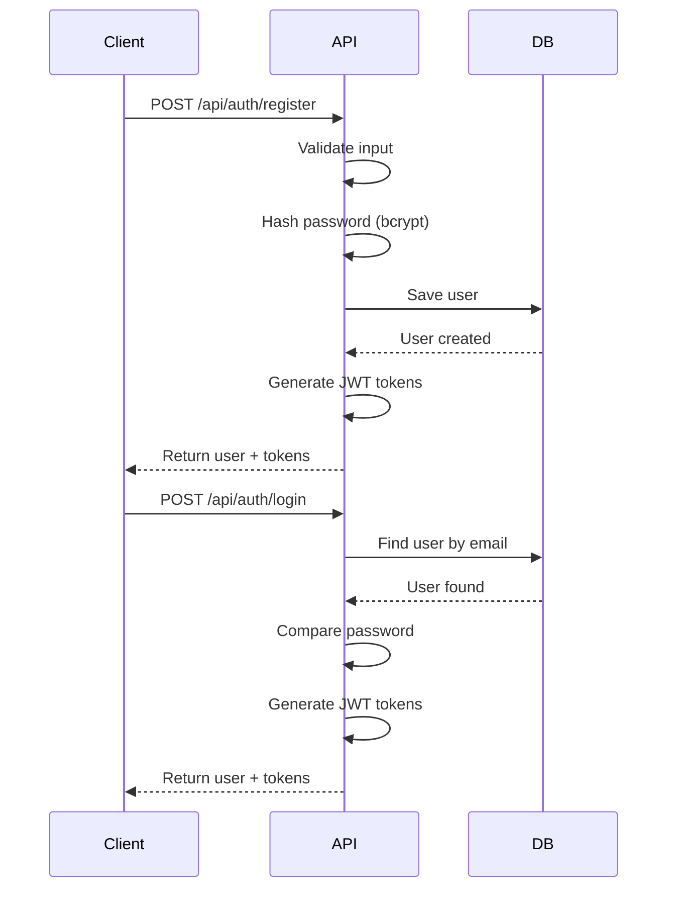
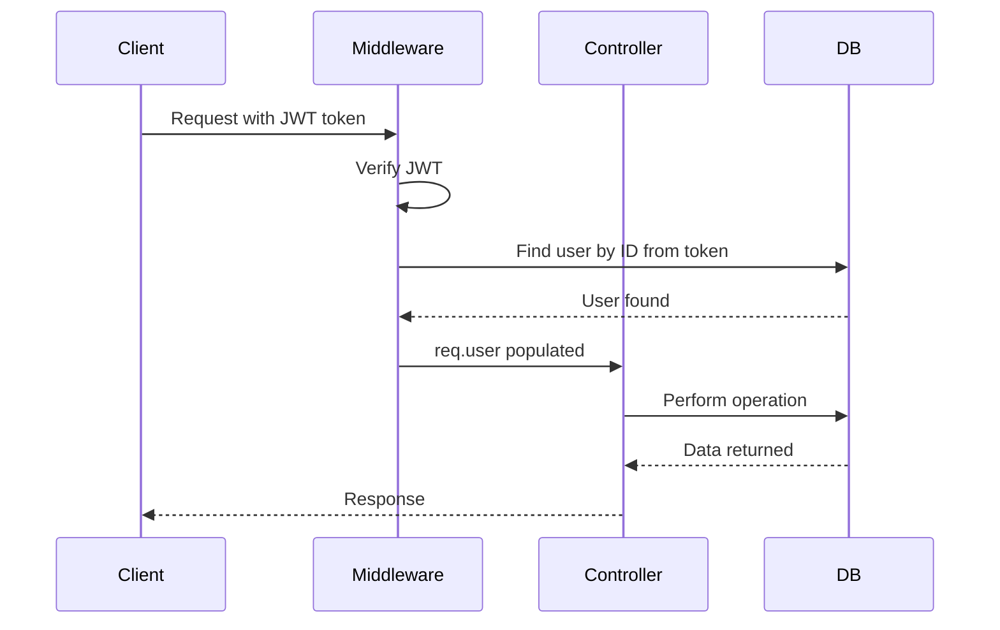

# 🔐 Node Server - Authentication & User Management

> Express + MongoDB backend for user authentication and health profile management


## 📋 Table of Contents

- [Overview](#overview)
- [Features](#features)
- [Technology Stack](#technology-stack)
- [Project Structure](#project-structure)
- [Prerequisites](#prerequisites)
- [Setup](#setup)
- [Running the Server](#running-the-server)
- [API Endpoints](#api-endpoints)
- [Database Schema](#database-schema)
- [Authentication Flow](#authentication-flow)
- [Environment Variables](#environment-variables)
- [Middleware](#middleware)
- [Error Handling](#error-handling)
- [Deployment](#deployment)
- [Development](#development)
- [Troubleshooting](#troubleshooting)

## 🎯 Overview

The **Node Server** provides authentication, user management, and health profile storage for the AI Health Ingredient Copilot. It handles JWT-based authentication, secure password management, and MongoDB data persistence.

### Key Responsibilities

- 🔐 **User Authentication** - Secure JWT-based login and registration
- 👤 **User Management** - CRUD operations for user accounts
- 🏥 **Health Profiles** - Store and manage user health conditions, allergies, and dietary preferences
- 🛡️ **Security** - Password hashing with bcrypt, helmet security headers
- 📊 **Data Persistence** - MongoDB with Mongoose ODM

## ✨ Features

### Core Features

- **JWT Authentication** - Stateless authentication with access & refresh tokens
- **Password Security** - bcrypt hashing with salt rounds
- **Email Validation** - Regex-based email format validation
- **Protected Routes** - Middleware-based route protection
- **Health Profile Management** - Comprehensive health data storage
- **CORS Support** - Configured for frontend integration

### Security Features

- **Helmet** - HTTP security headers
- **bcryptjs** - Password hashing (12 rounds)
- **JWT** - Token-based authentication
- **Input Validation** - express-validator
- **Error Handling** - Centralized error management

### Development Features

- **Nodemon** - Auto-restart on file changes
- **Morgan** - HTTP request logging
- **Environment Config** - Dotenv configuration
- **Mongoose** - Elegant MongoDB ODM

## 🛠 Technology Stack

| Technology | Version | Purpose |
|------------|---------|---------|
| **Node.js** | 18+ | JavaScript runtime |
| **Express** | 5.2.1 | Web framework |
| **MongoDB** | Latest | Database |
| **Mongoose** | 9.1.1 | MongoDB ODM |
| **JWT** | 9.0.3 | Authentication |
| **bcryptjs** | 3.0.3 | Password hashing |
| **Helmet** | 8.1.0 | Security headers |
| **CORS** | 2.8.5 | Cross-origin requests |
| **Morgan** | 1.10.1 | HTTP logging |
| **express-validator** | 7.3.1 | Input validation |

## 📁 Project Structure

```
NodeServer/
├── src/
│   ├── server.js              # Entry point
│   ├── config/                # Configuration
│   │   ├── env.config.js      # Environment variables
│   │   └── db.config.js       # MongoDB connection
│   ├── routes/                # API routes
│   │   ├── index.js           # Main router
│   │   ├── auth.routes.js     # Authentication routes
│   │   ├── profile.routes.js  # Health profile routes
│   │   └── ingredient.routes.js
│   ├── controllers/           # Request handlers
│   │   ├── auth.controller.js
│   │   ├── profile.controller.js
│   │   └── ingredient.controller.js
│   ├── models/                # Mongoose models
│   │   ├── User.model.js
│   │   └── HealthProfile.model.js
│   ├── middleware/            # Custom middleware
│   │   ├── auth.middleware.js
│   │   ├── errorHandler.js
│   │   ├── notFound.js
│   │   └── validators/
│   └── utils/                 # Utilities
│       ├── jwt.util.js
│       └── logger.js
├── logs/                      # Application logs
├── .env                       # Environment variables
├── .env.example               # Environment template
├── .gitignore
├── package.json
└── README.md                  # This file
```

## � Prerequisites

### Required Software

1. **Node.js 18+**
   ```bash
   node --version
   # Should output: v18.x.x or higher
   ```

2. **MongoDB**
   
   **Option A: Local Installation**
   ```bash
   # macOS
   brew tap mongodb/brew
   brew install mongodb-community
   brew services start mongodb-community
   
   # Linux
   sudo apt-get install -y mongodb
   sudo systemctl start mongod
   ```
   
   **Option B: MongoDB Atlas** (Recommended for production)
   - Sign up at [MongoDB Atlas](https://www.mongodb.com/cloud/atlas)
   - Create a cluster
   - Get connection string

3. **npm or yarn**
   ```bash
   npm --version
   # or
   yarn --version
   ```

## 🚀 Setup

### 1. Navigate to Project Directory
```bash
cd NodeServer
```

### 2. Install Dependencies
```bash
npm install
# or
yarn install
```

### 3. Configure Environment Variables
```bash
cp .env.example .env
```

Edit `.env` and configure:
```env
PORT=8080
MONGODB_URI=mongodb://localhost:27017/ingredisense
JWT_SECRET=your-super-secret-jwt-key-min-32-chars
FRONTEND_URL=http://localhost:5173
```

### 4. Start MongoDB (if running locally)
```bash
# macOS
brew services start mongodb-community

# Linux
sudo systemctl start mongod

# Verify MongoDB is running
mongosh
```

## 🏃 Running the Server

### Development Mode (with auto-restart)
```bash
npm run dev
```

### Production Mode
```bash
npm start
```

The server will start at: **http://localhost:8080**

## 🔌 API Endpoints

### Base URL
```
http://localhost:8080/api
```

### Health Check
```bash
GET /health
```

**Response:**
```json
{
  "status": "success",
  "message": "IngrediSense API is running",
  "timestamp": "2026-01-04T18:30:00.000Z",
  "environment": "development"
}
```

### Authentication Endpoints

#### Register User
```bash
POST /api/auth/register
Content-Type: application/json
```

**Request Body:**
```json
{
  "name": "John Doe",
  "email": "john@example.com",
  "password": "SecurePass123"
}
```

**Response:**
```json
{
  "success": true,
  "message": "User registered successfully",
  "data": {
    "user": {
      "id": "user_id",
      "name": "John Doe",
      "email": "john@example.com"
    },
    "token": "jwt_access_token",
    "refreshToken": "jwt_refresh_token"
  }
}
```

#### Login
```bash
POST /api/auth/login
Content-Type: application/json
```

**Request Body:**
```json
{
  "email": "john@example.com",
  "password": "SecurePass123"
}
```

**Response:**
```json
{
  "success": true,
  "message": "Login successful",
  "data": {
    "user": {
      "id": "user_id",
      "name": "John Doe",
      "email": "john@example.com"
    },
    "token": "jwt_access_token",
    "refreshToken": "jwt_refresh_token"
  }
}
```

### Health Profile Endpoints

#### Get User Health Profile
```bash
GET /api/profile
Authorization: Bearer <token>
```

**Response:**
```json
{
  "success": true,
  "data": {
    "allergies": ["peanuts", "dairy"],
    "conditions": ["diabetes", "hypertension"],
    "diets": ["low-carb", "gluten-free"],
    "goals": ["weight loss", "better energy"],
    "stats": {
      "age": "30",
      "weight": "70kg",
      "height": "175cm"
    }
  }
}
```

#### Update Health Profile
```bash
PUT /api/profile
Authorization: Bearer <token>
Content-Type: application/json
```

**Request Body:**
```json
{
  "allergies": ["peanuts", "dairy"],
  "conditions": ["diabetes"],
  "diets": ["keto"],
  "goals": ["weight loss"],
  "stats": {
    "age": "30",
    "weight": "70kg"
  }
}
```

## 💾 Database Schema

### User Model

```javascript
{
  name: String,              // Required, 2-50 characters
  email: String,             // Required, unique, validated
  password: String,          // Required, min 8 chars, hashed
  avatar: String,            // Profile picture URL
  role: String,              // 'user' or 'admin'
  isEmailVerified: Boolean,  // Email verification status
  passwordChangedAt: Date,   // Password change timestamp
  createdAt: Date,           // Auto-generated
  updatedAt: Date            // Auto-generated
}
```

### Health Profile Model

```javascript
{
  user: ObjectId,            // Reference to User (unique)
  allergies: [String],       // Food allergies
  conditions: [String],      // Health conditions
  diets: [String],           // Dietary preferences
  goals: [String],           // Health goals
  stats: Map<String>,        // Flexible key-value stats
  profileCompleted: Boolean, // Profile completion status
  createdAt: Date,           // Auto-generated
  updatedAt: Date            // Auto-generated
}
```

## � Authentication Flow

### Registration & Login Flow



### Protected Route Access



## � Environment Variables

| Variable | Description | Default | Required |
|----------|-------------|---------|----------|
| `PORT` | Server port | `8080` | ❌ |
| `NODE_ENV` | Environment | `development` | ❌ |
| `MONGODB_URI` | MongoDB connection string | - | ✅ |
| `JWT_SECRET` | JWT signing secret (min 32 chars) | - | ✅ |
| `JWT_EXPIRE` | Access token expiration | `1h` | ❌ |
| `JWT_REFRESH_SECRET` | Refresh token secret | - | ✅ |
| `JWT_REFRESH_EXPIRE` | Refresh token expiration | `7d` | ❌ |
| `BCRYPT_ROUNDS` | bcrypt salt rounds | `12` | ❌ |
| `FRONTEND_URL` | Frontend CORS origin | `http://localhost:5173` | ❌ |

## �️ Middleware

### Authentication Middleware
```javascript
// Protects routes requiring authentication
import { protect } from './middleware/auth.middleware.js';

router.get('/profile', protect, getProfile);
```

### Error Handler Middleware
```javascript
// Centralized error handling
app.use(errorHandler);
```

### Validation Middleware
```javascript
// Input validation with express-validator
import { validateRegister } from './middleware/validators/auth.validator.js';

router.post('/register', validateRegister, register);
```

## ⚠️ Error Handling

### Error Response Format
```json
{
  "success": false,
  "error": {
    "message": "Error description",
    "statusCode": 400,
    "stack": "Error stack (development only)"
  }
}
```

### Common Error Codes

| Status | Description |
|--------|-------------|
| 400 | Bad Request - Invalid input |
| 401 | Unauthorized - Invalid/missing token |
| 403 | Forbidden - Insufficient permissions |
| 404 | Not Found - Resource doesn't exist |
| 409 | Conflict - Duplicate resource |
| 500 | Internal Server Error |

## 🚀 Deployment

### Railway Deployment

```bash
# Install Railway CLI
npm i -g @railway/cli

# Login
railway login

# Initialize
railway init

# Add MongoDB service in Railway dashboard

# Deploy
railway up
```

**Environment Variables (Railway Dashboard):**
- `MONGODB_URI`: MongoDB connection string
- `JWT_SECRET`: Random 32+ character string
- `JWT_REFRESH_SECRET`: Different random string
- `FRONTEND_URL`: Your frontend URL
- `NODE_ENV`: `production`

### Render.com Deployment

1. **Create New Web Service**
   - Connect GitHub repository
   - Select `NodeServer` directory

2. **Build & Start Commands**
   ```bash
   # Build Command (leave empty if no build step)
   
   # Start Command
   npm start
   ```

3. **Environment Variables**
   - Add all required variables in dashboard

### Docker Deployment

Create `Dockerfile`:
```dockerfile
FROM node:18-alpine

WORKDIR /app

COPY package*.json ./
RUN npm ci --only=production

COPY src ./src

EXPOSE 8080

CMD ["npm", "start"]
```

Build and run:
```bash
docker build -t node-server .
docker run -p 8080:8080 --env-file .env node-server
```

## 💻 Development

### Scripts
```bash
npm run dev      # Development with nodemon
npm start        # Production server
npm test         # Run tests (to be implemented)
```

### Adding New Routes
```javascript
// src/routes/example.routes.js
import express from 'express';
import { protect } from '../middleware/auth.middleware.js';

const router = express.Router();

router.get('/example', protect, (req, res) => {
  res.json({ user: req.user });
});

export default router;
```

### Database Operations
```javascript
import User from './models/User.model.js';

// Create
const user = await User.create({ name, email, password });

// Find
const user = await User.findById(id);
const users = await User.find({ role: 'user' });

// Update
const updated = await User.findByIdAndUpdate(id, data, { new: true });

// Delete
await User.findByIdAndDelete(id);
```

## 🐛 Troubleshooting

### MongoDB Connection Errors

**Error:**
```
MongoNetworkError: failed to connect to server
```

**Solution:**
```bash
# Check if MongoDB is running
brew services list | grep mongodb
# or
sudo systemctl status mongod

# Start MongoDB
brew services start mongodb-community
# or
sudo systemctl start mongod

# Verify connection string in .env
MONGODB_URI=mongodb://localhost:27017/ingredisense
```

### JWT Token Errors

**Error:**
```
JsonWebTokenError: invalid signature
```

**Solution:**
- Ensure `JWT_SECRET` is set in `.env`
- Check token is being sent in Authorization header
- Verify token format: `Bearer <token>`

### Port Already in Use

**Error:**
```
Error: listen EADDRINUSE: address already in use
```

**Solution:**
```bash
# Find process using port
lsof -i :8080

# Kill process
kill -9 <PID>

# Or change port in .env
PORT=8081
```

### CORS Errors

**Error:**
```
Access to fetch blocked by CORS policy
```

**Solution:**
- Check `FRONTEND_URL` in `.env` matches frontend
- Ensure CORS middleware is configured
- Verify frontend is sending credentials if needed

## 📊 Logging

Logs are stored in `logs/` directory:
- `info.log` - General information
- `error.log` - Error messages
- `warn.log` - Warnings
- `debug.log` - Debug info (dev only)

## 📄 License

ISC

## 🤝 Contributing

Built for ENCODE 2026 Hackathon at IIT Guwahati.

---

**Built with � by ENCODE 2026 Team**
