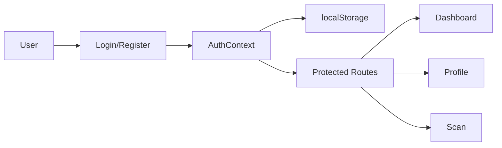

# 🎨 Frontend - AI Health Ingredient Copilot

> React + Vite + TailwindCSS modern web application for health ingredient analysis


## 📋 Table of Contents

- [Overview](#overview)
- [Features](#features)
- [Technology Stack](#technology-stack)
- [Project Structure](#project-structure)
- [Getting Started](#getting-started)
- [Available Scripts](#available-scripts)
- [Environment Variables](#environment-variables)
- [Component Architecture](#component-architecture)
- [Routing](#routing)
- [API Integration](#api-integration)
- [Styling Guide](#styling-guide)
- [Development Guidelines](#development-guidelines)
- [Build & Deployment](#build--deployment)

## 🎯 Overview

This is the frontend application for the AI Health Ingredient Copilot, built with React 19 and Vite. It provides a modern, responsive user interface for analyzing food ingredients, managing health profiles, and receiving AI-powered health recommendations.

### Key Features

- 🔐 **Secure Authentication** - JWT-based login and registration
- 👤 **Health Profile Management** - Personalized health condition tracking
- 📸 **Image Analysis** - Upload or provide URLs for food label scanning
- 🤖 **AI Insights** - Real-time health risk assessment with visual indicators
- 📱 **Fully Responsive** - Beautiful design across all devices
- ⚡ **Lightning Fast** - Vite's instant HMR for smooth development
- 🎨 **Modern UI** - TailwindCSS 4 with custom design system
- ✨ **Smooth Animations** - Framer Motion for delightful interactions

## ✨ Features

### Pages

- **Home** - Landing page with feature showcase
- **Dashboard** - User overview and health profile banner
- **Scan** - Food label analysis interface
- **Profile** - User profile and health conditions management
- **About** - Information about the platform
- **Services** - Available services description
- **Guidelines** - Usage guidelines and best practices
- **Gallery** - Sample analyses and results
- **FAQ** - Frequently asked questions
- **Contact** - Contact form

### Components

- **Authentication** - Login and registration forms
- **Health Analysis Display** - AI-generated insights with formatting
- **Protected Routes** - Access control for authenticated users
- **Layout Components** - Navbar, Footer, and page wrappers
- **Dashboard Widgets** - Health profile cards and quick stats

## 🛠 Technology Stack

| Technology | Version | Purpose |
|------------|---------|---------|
| **React** | 19.2.0 | UI framework |
| **Vite** | 7.2.4 | Build tool & dev server |
| **TailwindCSS** | 4.1.18 | Utility-first CSS framework |
| **Framer Motion** | 12.23.26 | Animation library |
| **React Router** | 7.11.0 | Client-side routing |
| **Axios** | 1.13.2 | HTTP client |
| **React Icons** | 5.5.0 | Icon library |
| **React Webcam** | 7.2.0 | Webcam integration |

## 📁 Project Structure

```
frontend/
├── public/                    # Static assets
│   └── vite.svg              # Vite logo
├── src/
│   ├── assets/               # Images, fonts, etc.
│   │   └── react.svg
│   ├── components/           # Reusable components
│   │   ├── Layout/          # Layout components
│   │   ├── ProtectedRoute.jsx
│   │   ├── about/           # About page components
│   │   ├── auth/            # Authentication components
│   │   ├── contact/         # Contact form components
│   │   ├── dashboard/       # Dashboard widgets
│   │   │   └── HealthAnalysisDisplay.jsx
│   │   ├── home/            # Home page components
│   │   └── profile/         # Profile page components
│   ├── context/             # React Context providers
│   │   └── AuthContext.jsx  # Authentication context
│   ├── pages/               # Route pages
│   │   ├── HomePage.jsx
│   │   ├── DashboardPage.jsx
│   │   ├── ScanPage.jsx
│   │   ├── ProfilePage.jsx
│   │   ├── AboutPage.jsx
│   │   ├── ServicesPage.jsx
│   │   ├── GuidelinesPage.jsx
│   │   ├── GalleryPage.jsx
│   │   ├── FAQPage.jsx
│   │   ├── ContactPage.jsx
│   │   └── DocsPage.jsx
│   ├── services/            # API integration
│   │   ├── api/             # API configuration
│   │   ├── auth.service.js  # Authentication API
│   │   ├── profile.service.js  # Profile API
│   │   └── healthAgent.service.js  # Health analysis API
│   ├── App.jsx              # Main app component with routes
│   ├── App.css              # App-specific styles
│   ├── index.css            # Global styles
│   └── main.jsx             # App entry point
├── .env.example             # Environment variables template
├── .gitignore
├── eslint.config.js         # ESLint configuration
├── index.html               # HTML entry point
├── package.json
├── README.md                # This file
└── vite.config.js           # Vite configuration
```

## 🚀 Getting Started

### Prerequisites

- **Node.js** 18+ ([Download](https://nodejs.org/))
- **npm** or **yarn** or **pnpm**

### Installation

1. **Navigate to frontend directory**
   ```bash
   cd frontend
   ```

2. **Install dependencies**
   ```bash
   npm install
   # or
   yarn install
   # or
   pnpm install
   ```

3. **Setup environment variables**
   ```bash
   cp .env.example .env
   ```
   
   Edit `.env` and configure:
   ```env
   VITE_API_BASE_URL=http://localhost:8080/api
   VITE_FASTAPI_BASE_URL=http://localhost:8000/api/v1
   VITE_APP_NAME=AI Health Ingredient Copilot
   ```

4. **Start development server**
   ```bash
   npm run dev
   ```

5. **Open browser**
   Navigate to [http://localhost:5173](http://localhost:5173)

## 📜 Available Scripts

```bash
# Development server with HMR
npm run dev

# Build for production
npm run build

# Preview production build
npm run preview

# Run ESLint
npm run lint
```

## 🔐 Environment Variables

Create a `.env` file in the root of the frontend directory:

```env
# =================================
# API Configuration
# =================================

# Node.js Authentication Server
VITE_API_BASE_URL=http://localhost:8080/api

# FastAPI Health Analysis Server
VITE_FASTAPI_BASE_URL=http://localhost:8000/api/v1

# =================================
# App Configuration
# =================================

VITE_APP_NAME=AI Health Ingredient Copilot
VITE_APP_VERSION=1.0.0

# =================================
# Feature Flags
# =================================

VITE_ENABLE_ANALYTICS=false
VITE_ENABLE_DEBUG=false

# =================================
# Production URLs (for deployment)
# =================================

# VITE_API_BASE_URL=https://your-node-api.com/api
# VITE_FASTAPI_BASE_URL=https://your-fastapi.com/api/v1
```

### Environment Variable Usage

Access environment variables in code:
```javascript
const API_URL = import.meta.env.VITE_API_BASE_URL;
const APP_NAME = import.meta.env.VITE_APP_NAME;
```

## 🏗 Component Architecture

### Authentication Flow



### Context Providers

- **AuthContext** - Manages authentication state, user info, and auth tokens

### Protected Routes

Routes that require authentication use the `ProtectedRoute` wrapper:
```jsx
<Route path="/dashboard" element={
  <ProtectedRoute>
    <DashboardPage />
  </ProtectedRoute>
} />
```

## 🗺 Routing

Routes are defined in `App.jsx`:

| Path | Component | Protected | Description |
|------|-----------|-----------|-------------|
| `/` | HomePage | ❌ | Landing page |
| `/dashboard` | DashboardPage | ✅ | User dashboard |
| `/scan` | ScanPage | ✅ | Food label analysis |
| `/profile` | ProfilePage | ✅ | User profile |
| `/about` | AboutPage | ❌ | About page |
| `/services` | ServicesPage | ❌ | Services info |
| `/guidelines` | GuidelinesPage | ❌ | Usage guidelines |
| `/gallery` | GalleryPage | ❌ | Sample results |
| `/faq` | FAQPage | ❌ | FAQ |
| `/contact` | ContactPage | ❌ | Contact form |

## 🔌 API Integration

### Service Architecture

All API calls are organized in the `services/` directory:

**auth.service.js**
```javascript
import api from './api/config';

export const authService = {
  login: (credentials) => api.post('/auth/login', credentials),
  register: (userData) => api.post('/auth/register', userData),
  // ...
};
```

**healthAgent.service.js**
```javascript
import axios from 'axios';

const FASTAPI_URL = import.meta.env.VITE_FASTAPI_BASE_URL;

export const analyzeImage = async (file, healthProfile) => {
  const formData = new FormData();
  formData.append('file', file);
  formData.append('user_health_profile', healthProfile);
  
  return axios.post(`${FASTAPI_URL}/analyze`, formData);
};
```

### API Interceptors

Axios interceptors handle authentication tokens:
```javascript
api.interceptors.request.use((config) => {
  const token = localStorage.getItem('token');
  if (token) {
    config.headers.Authorization = `Bearer ${token}`;
  }
  return config;
});
```

## 🎨 Styling Guide

### TailwindCSS 4

This project uses TailwindCSS 4 with the Vite plugin:

```javascript
// vite.config.js
import tailwindcss from '@tailwindcss/vite';

export default {
  plugins: [react(), tailwindcss()],
};
```

### Custom Styles

Global styles are in `index.css`:
```css
@import "tailwindcss";

@theme {
  /* Custom theme configuration */
}
```

### Design Tokens

Common color palette:
- Primary: Blue shades
- Success: Green (`🟢`)
- Warning: Yellow (`🟡`)
- Danger: Red (`🔴`)

### Responsive Design

Mobile-first approach with breakpoints:
- `sm`: 640px
- `md`: 768px
- `lg`: 1024px
- `xl`: 1280px
- `2xl`: 1536px

## 💡 Development Guidelines

### Code Style

- Use functional components with hooks
- Follow ESLint rules (check `eslint.config.js`)
- Use arrow functions for consistency
- Destructure props for clarity

### Best Practices

1. **Component Organization**
   - One component per file
   - Group related components in folders
   - Use index.js for barrel exports

2. **State Management**
   - Use Context for global state (auth)
   - Use local state for component-specific data
   - Avoid prop drilling

3. **Error Handling**
   - Always handle API errors
   - Provide user-friendly error messages
   - Use try-catch blocks

4. **Performance**
   - Lazy load routes when possible
   - Optimize images
   - Use React.memo for expensive components

### Naming Conventions

- Components: PascalCase (`HomePage.jsx`)
- Functions: camelCase (`handleSubmit`)
- Constants: UPPER_SNAKE_CASE (`API_BASE_URL`)
- CSS classes: kebab-case (Tailwind utilities)

## 🚀 Build & Deployment

### Production Build

```bash
npm run build
```

This creates an optimized build in the `dist/` directory.

### Preview Production Build

```bash
npm run preview
```

### Deployment Platforms

#### Vercel (Recommended)

```bash
# Install Vercel CLI
npm i -g vercel

# Deploy
vercel
```

Environment variables:
- Add in Vercel dashboard under Settings → Environment Variables

#### Netlify

```bash
# Build command
npm run build

# Publish directory
dist
```

Create `netlify.toml`:
```toml
[build]
  command = "npm run build"
  publish = "dist"

[[redirects]]
  from = "/*"
  to = "/index.html"
  status = 200
```

#### GitHub Pages

Update `vite.config.js`:
```javascript
export default {
  base: '/your-repo-name/',
  // ...
};
```

## 🐛 Troubleshooting

### Common Issues

**Port 5173 already in use**
```bash
# Kill process on port 5173
lsof -ti:5173 | xargs kill -9

# Or change port
npm run dev -- --port 3000
```

**Build errors**
```bash
# Clear cache and reinstall
rm -rf node_modules package-lock.json
npm install
```

**Environment variables not loading**
- Ensure variables start with `VITE_`
- Restart dev server after changing `.env`

**CORS errors**
- Check backend CORS configuration
- Ensure API URLs in `.env` are correct

## 📚 Resources

- [React Documentation](https://react.dev/)
- [Vite Documentation](https://vitejs.dev/)
- [TailwindCSS Documentation](https://tailwindcss.com/)
- [React Router Documentation](https://reactrouter.com/)

---

**Built with ⚡ by ENCODE 2026 Team**
